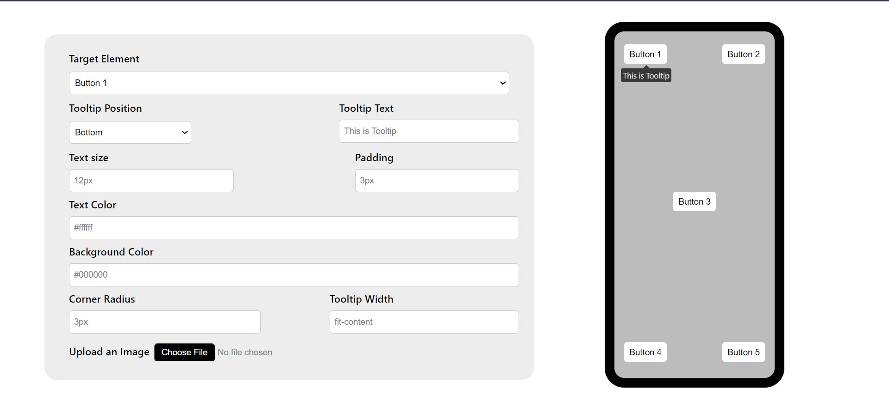

# Dynamic Tooltip React App

** Github Page Link **
https://himavarshithreddy.github.io/dynamic-tooltip/

## Description

This is a React application that allows users to create and customize tooltips for buttons. Users can adjust various tooltip attributes such as text, position, size, and colors, and even add custom images. This project is designed to demonstrate how to manage state and user interactions in a React application.

## Features

- **Button Selection**: Choose a button from a dropdown menu to customize its tooltip.

- **Tooltip Customization**: Modify tooltip properties including text, position, text size, padding, text color, background color, corner radius, and width.

- **Image Upload**: Upload custom images to be displayed within tooltips.

 ## Usage

- Select a button from the dropdown to customize its tooltip.
  
- -Modify the tooltip settings using the input fields and dropdowns.
  
- -To upload an image for the tooltip, use the "Upload an Image" button.

  
## Acknowledgments

- This project was created as a learning exercise for React state management and user interfaces.

## Author

**Himavarshith Reddy**

